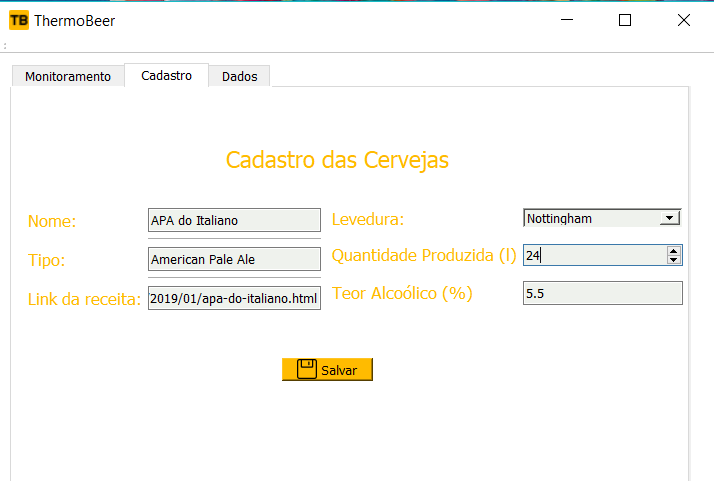

# ThermoBeer
Aplicação do ThermoBeer com a framework Qt, a  e o microcontrolador ESP8266.

## Sumário
* [O que é o ThermoBeer](https://github.com/calebeof/ThermoBeer#o-que-%C3%A9-o-thermobeer)
* [Manual do Usuário](https://github.com/calebeof/ThermoBeer#manual-do-usu%C3%A1rio)
  * [Como Funciona o ThermoBeer?](https://github.com/calebeof/ThermoBeer#como-funciona-o-thermobeer)
  * [Como adquirir o ThermoBeer?](https://github.com/calebeof/ThermoBeer#como-adquirir-o-thermobeer)
  * [Utilizando o software do ThermoBeer](https://github.com/calebeof/ThermoBeer#utilizando-o-software-do-thermobeer)
    * [Monitorando a temperatura](https://github.com/calebeof/ThermoBeer#monitorando-a-temperatura)
    * [Cadastrando novas cervejas](https://github.com/calebeof/ThermoBeer#cadastrando-novas-cervejas)
    * [Carregando cervejas salvas](https://github.com/calebeof/ThermoBeer#carregando-cervejas-salvas)
  * [Utilizando o site do ThermoBeer](https://github.com/calebeof/ThermoBeer#utilizando-o-site-da-thermobeer)
    * [Monitorando a temperatura com os limites](https://github.com/calebeof/ThermoBeer#monitorando-a-temperatura-com-os-limites)
    * [Alterando o estado do relé](https://github.com/calebeof/ThermoBeer#alterando-o-estado-do-rel%C3%A9)
  * [Informações técnicas](https://github.com/calebeof/ThermoBeer#informa%C3%A7%C3%B5es-t%C3%A9cnicas)
    * [Materiais](https://github.com/calebeof/ThermoBeer#materiais)
    * [O Circuito](https://github.com/calebeof/ThermoBeer#o-circuito)
    * [A Página Web](https://github.com/calebeof/ThermoBeer#a-p%C3%A1gina-web)
    * [O Software para Desktop](https://github.com/calebeof/ThermoBeer#o-software-para-desktop)
    
## O que é o ThermoBeer?

O cenário brasileiro de cervejas artesanais está cada vez mais crescendo. As pessoas estão, não só vendendo, mas produzindo cervejas para seu próprio consumo. Sendo assim, uma comunidade foi construída para a produção das cervejas, de maneira a promover dicas e formas de utilização.

As etapas de produção de uma cerveja são demoradas. Algumas delas são a malteação, a moagem, a fervura, a mostura, a fermentação,  o resfriamento e a maturação. Dentre estes estágios, um dos mais complicados é a da fermentação, na qual a maioria dos cervejeiros ficam resfriando o seu balde de cerveja enquanto esta passa pelo processo de fermentação. Este resfriamento é feito por checagem mesmo, e faz-se necessário uma quantidade enorme de tempo para verificar a temperatura do balde de cerveja, de maneira a ter que esquentá-lo ou resfriá-lo manualmente e verificar com um termômetro, colocando na mão mesmo. 

Como este processo manual pode realmente durar bastante tempo e paciência destes produtores, surge a proposta do ThermoBeer, que ataca os problemas maiores desta etapa: a checagem da temperatura e o resfriamento. 

## Manual do Usuário

### Como Funciona o ThermoBeer?

A ideia do projeto é que o cervejeiro artesanal possa ter acesso à temperatura da sua cerveja e possa ter controle sobre a refrigeração dela no momento que esteja na sua fase de fermentação. Para isso, será disponibilizado um site no qual haverá as informações da temperatura da cerveja durante o processo, medida por um sensor. A refrigeração será controlada a partir de um relé, no qual é acionado ou desligado pelo usuário a partir de seu comando via web. Também há um software para que o usuário seja avisado diretamente via desktop, para a possibilidade de uso offline. 

### Como adquirir o ThermoBeer?

Se desejas utilizar o software do ThermoBeer e usa uma distribuição Linux ou Mac, basta fazer o download do repositório e executar o arquivo ThermoBeer.pro com o QT Creator. Já para Windows, há a possibilidade de ter seu programa no pc sem software adicional, bastando apenas baixar a pasta "programa" deste repositório e extraí-la em seu pc. Nesta pasta haverá todos os arquivos .dll necessários para executar o programa na sua máquina e sem instalar nada. 

### Utilizando o software do ThermoBeer
#### Monitorando a temperatura 

A tela de início da aplicação do projeto é bastante direta. Primeiro, o usuário deve conectar o seu cabo microUSB da ESP8266 com alguma entrada USB do seu computador. A seguir, deve ser selecionada a porta na qual a placa está conectada. Para que as informações sejam passadas, faz-se necessário ter uma velocidade específica (em bauds) para comunicação, sendo selecionado 115200 a padrão da placa. Haverá um texto exibindo se o programa conseguiu se conectar com a placa ou não, após clicar no botão de Conectar. Se conseguiu, a temperatura será passada instantaneamente. Se não foi possível, há a possibilidade de clicar no botão Reiniciar, no qual tentará a comunicação novamente. 

#### Cadastrando novas cervejas

Também há a possibilidade de cadastrar suas cervejas, para maior facilidade em selecioná-las posteriormente. Na aba de Cadastro, devem ser preenchidos o Nome, o Tipo, o Link da Receita (para consulta a posteriori), a Levedura da cerveja, da Quantidade Produzida e o Teor Alcóolico. Qualquer uma dessas informações não preenchidas, resultará em uma mensagem de aviso para serem informadas, ou seja, são obrigatórias. Basta, em seguida, clicar em Salvar. Ao clicar em Salvar, o usuário deve escolher onde quer salvar o seu arquivo de cervejas, podendo organizá-las em pastas de categorias depois.

#### Carregando cervejas salvas

Na aba de Dados, há a possibilidade de consultar os arquivos das cervejas salvas e carregá-las para o programa, a fim de selecioná-las para verificar os limites corrigidos da levedura no site. Ao clicar em Mostrar, será enviada a informação diretamente ao [site](https://thermobeer.herokuapp.com), se houver conexão da ESP8266 com a internet, com as delimitações dos limites necessários para cada levedura. 

### Utilizando o site da ThermoBeer

#### Monitorando a temperatura com os limites

O [site](https://thermobeer.herokuapp.com) da ThermoBeer permite que o usuário tenha acesso remoto à aplicação, apenas sendo necessário conexão com a internet. Aqui, temos uma barra de temperatura do termômetro com os ajustes finos dos limites da levedura escolhida via software do computador, de maneira a mostrar para o usuário se ele deve ou não desligar o relé do refrigerador.

#### Alterando o estado do Relé

Também há as informações da conexão, da temperatura, da cerveja atual (escolhida previamente) e do estado do relé. Os botões de ligar e desligar permitem o controle do relé responsável pela refrigeração, de maneira a conseguir realizar o propósito de oferecer ao usuário um controle fora do ambiente do nosso circuito. 

### Informações técnicas

#### Materiais 

- [ESP8266](https://cdn-shop.adafruit.com/product-files/2471/0A-ESP8266__Datasheet__EN_v4.3.pdf)
- Sensor de Temperatura à Prova D'água [DS18B20](https://datasheets.maximintegrated.com/en/ds/DS18B20.pdf)
 - [Módulo Relé](https://www.fecegypt.com/uploads/dataSheet/1480848003_2_channel_5v_10a_relay_module.pdf)

#### O Circuito

Utilizamos o sensor DS18B20 pois este é à prova d'água, facilitando o processo de captura das informações da temperatura da cerveja. Além disso, precisamos do módulo relé de 5V para acionar o refrigerador, a fim de permitir o controle da situação da fermentação pelo usuário. É notável aqui que a ESP8266 é fundamental para todo o processo de alimentação do circuito e da comunicação tanto com a página web quanto com o software para computador, visto que ela é quem passa e recebe as informações para o circuito, sendo o "cérebro" de tudo.

Também vale a pena levantar o ponto de que a ESP8266 precisa estar conectada à uma rede WiFi com internet para poder comunicar-se com a página web. Entretanto, a alternativa offline para este caso é apenas plugar o seu cabo microUSB em uma porta USB do computador, de maneira que o usuário possa obter as informações via serial pelo software. 

#### A Página Web

Esta página web está hospedada gratuitamente no Heroku, uma plataforma cloud que permite o deploy de aplicações para desenvolvedores. Aqui, foi utilizado HTML e CSS, para poder organizar o site, além de JavaScript e Python, para reagir à eventos e fazer a comunicação com o software para computador e para a ESP8266. É notável indicar a importância da biblioteca Flask feita pela comunidade do Python, que é bastante crítica para a realização da comunicação e o deploy do servidor. 

#### O Software para Desktop

Desenvolvemos um software para pc a fim do usuário ter controle da nossa aplicação mesmo sem acesso à internet. Aqui, foi utilizado a framework Qt junto com a IDE Qt Creator. A linguagem utilizada foi o C++ e ainda foi necessário a utilização de XML para editar a parte gráfica do programa. 
